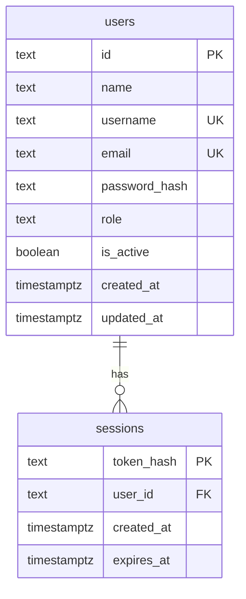

# Tài khoản và phiên đăng nhập

<!-- Đã chuyển sang Firebase Authentication; giữ thiết kế SQL cũ để tham khảo, chưa dùng cho Firebase. -->
Hiện project dùng Firebase Authentication. Xem [firebase-auth.md](./firebase-auth.md) để cấu hình và theo dõi luồng đang triển khai. Phần bên dưới mô tả thiết kế tự quản lý trước đây, chưa dùng trong luồng Firebase hiện tại.

<!-- Thiết kế giai đoạn đầu; auth-schema.sql chưa được chạy tự động lên database. -->

## Quan hệ

Một người dùng có từ 0 đến nhiều phiên đăng nhập. Mỗi phiên thuộc đúng một người dùng. Đăng nhập trên hai thiết bị tạo hai phiên độc lập; đăng xuất một thiết bị chỉ xóa phiên của thiết bị đó. Xóa người dùng sẽ xóa tất cả phiên liên quan.

## Tài khoản

`users` lưu thông tin người dùng, không lưu mật khẩu dạng chữ gốc. `password_hash` chứa kết quả băm mật khẩu, salt và thông số cần để kiểm tra lại. Hàm băm mật khẩu phải được chọn và triển khai riêng ở bước backend; SHA-256 dùng cho token phiên bên dưới không phải thuật toán băm mật khẩu.

Username được trim và chuyển chữ thường trước khi lưu/tìm kiếm. Chỉ chấp nhận 3–30 ký tự gồm chữ cái Latin, chữ số, `_`, `.`. Email được trim và chuyển chữ thường theo quy ước của ứng dụng. Backend phải kiểm tra định dạng email; CHECK trong SQL chỉ kiểm tra chuẩn hóa và độ dài. UNIQUE trong database vẫn là lớp chống trùng cuối cùng khi hai yêu cầu đăng ký xảy ra đồng thời.

Đăng ký công khai luôn tạo `role = customer`, không nhận role từ form. Quyền admin được cấp bằng thao tác quản trị phía server. Tài khoản demo `admin / 1234` hiện tại chưa phải bản ghi database và không được tự tạo bởi SQL này.

`is_active = false` khóa tài khoản. Các lần kiểm tra phiên sau đó phải kiểm tra trạng thái tài khoản để ngừng chấp nhận phiên cũ. Backend cập nhật `updated_at` khi sửa tài khoản; DEFAULT trong SQL chỉ áp dụng khi INSERT.

## Phiên đăng nhập

Luồng dự kiến:

1. Server kiểm tra username và mật khẩu.
2. Tạo token bằng bộ sinh số ngẫu nhiên mật mã, tối thiểu 32 byte.
3. Lưu SHA-256 của token vào `sessions.token_hash`, cùng user ID và thời điểm hết hạn.
4. Gửi token gốc bằng cookie HttpOnly; cookie dùng SameSite=Lax, Path=/ và Secure khi chạy HTTPS production.
5. Mỗi lần xác thực, băm token trong cookie rồi tra session, kiểm tra `expires_at > CURRENT_TIMESTAMP` và `users.is_active = true`.
6. Đăng xuất xóa dòng session hiện tại và cookie. Đăng nhập mới tạo token mới.

Hạn phiên dự kiến 7 ngày, không tự gia hạn ở phiên bản đầu. Cookie và database dùng cùng thời điểm hết hạn. Phiên hết hạn có thể còn là một dòng trong bảng nhưng không được chấp nhận; tác vụ dọn dữ liệu sẽ xóa các dòng hết hạn sau.

Không lưu mật khẩu hoặc token phiên trong localStorage, không gửi `password_hash` hay `token_hash` về component giao diện. Giỏ khách trong localStorage hiện tại tiếp tục là dữ liệu riêng, chưa liên kết với tài khoản.

## Thực hiện bước hiện tại

Mở Query Tool của `shop_app`, mở [auth-schema.sql](./auth-schema.sql), chọn toàn bộ và Execute script. Sau khi thành công, refresh `Schemas → public → Tables` để xem thêm `users`, `sessions`. Hai bảng lúc này chưa có dữ liệu.

Bước tiếp theo là viết xử lý đăng ký/đăng nhập phía server, kiểm tra dữ liệu, băm mật khẩu, hạn chế thử đăng nhập liên tục và nối form hiện tại. Phải kiểm tra quyền trên server tại các thao tác cần bảo vệ; role trong giao diện không thay thế kiểm tra quyền.

Tham khảo: [Next.js Authentication và quản lý phiên](https://nextjs.org/docs/app/guides/authentication).
