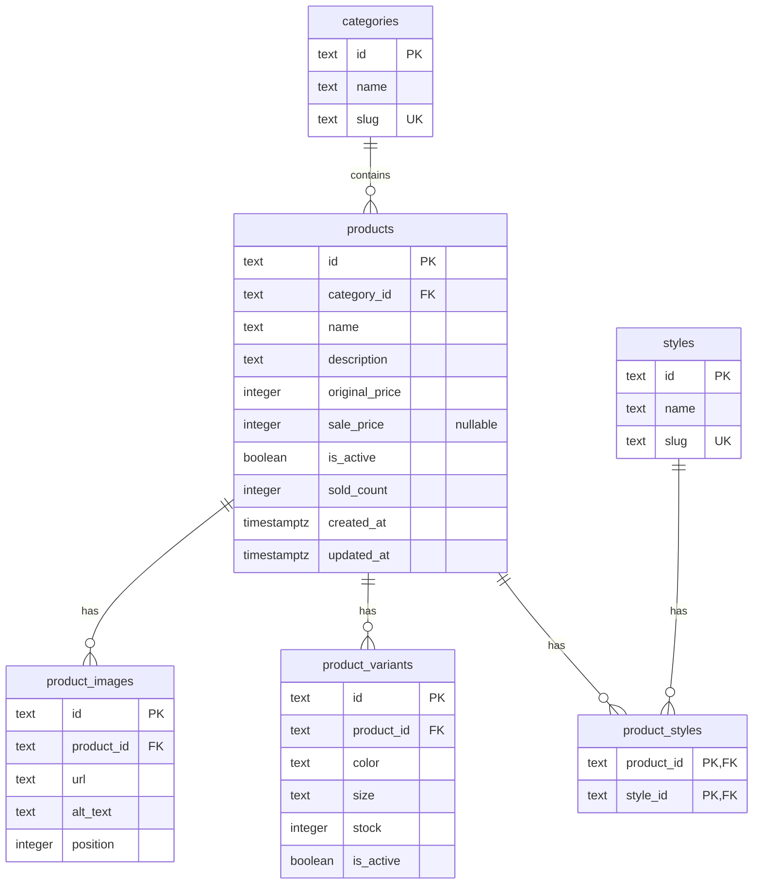

# Thiết kế database shop-app

<!-- Tài liệu thiết kế: chưa chạy SQL, chưa thay mock-data và chưa kết nối database. -->

## Phạm vi đầu tiên

Thiết kế danh mục sản phẩm trước để thay `lib/mock-data.ts`. Bản SQL đi kèm nhắm đến PostgreSQL; đây là đề xuất kỹ thuật, chưa cài đặt dịch vụ hay chọn nhà cung cấp.

Giữ nguyên `originalPrice` + `salePrice` ở phía ứng dụng. Trong database dùng tên cột snake_case, ví dụ `original_price`; lớp đọc dữ liệu sẽ chuyển sang camelCase.

Giỏ khách tiếp tục dùng localStorage. Tài khoản, giỏ đã đăng nhập và đơn hàng là giai đoạn tiếp theo.

## Sơ đồ quan hệ

`PK` là khóa chính: xác định duy nhất một dòng. `FK` là khóa ngoại: liên kết đến dòng trong bảng khác. `UK` là giá trị duy nhất.

Một danh mục có nhiều sản phẩm; một sản phẩm thuộc một danh mục, giống dữ liệu hiện tại. Một sản phẩm có nhiều ảnh và biến thể. Một sản phẩm có nhiều style và một style có nhiều sản phẩm, nên cần bảng nối `product_styles`.

## Các bảng

| Bảng | Vai trò | Ràng buộc chính |
| --- | --- | --- |
| `categories` | T-shirts, Jeans, Hoodie… | `slug` duy nhất, ví dụ `hoodie` |
| `styles` | Casual, Formal, Party, Gym | `slug` duy nhất, ví dụ `casual` |
| `products` | Thông tin chung và giá sản phẩm | Danh mục phải tồn tại; giá hợp lệ |
| `product_images` | URL ảnh và thứ tự thumbnail | Không trùng `position` trong một sản phẩm |
| `product_variants` | Mỗi tổ hợp màu + size và tồn kho | Không trùng `(product_id, color, size)` |
| `product_styles` | Liên kết sản phẩm với style | Không trùng `(product_id, style_id)` |

Các trường bắt buộc được ghi `NOT NULL` trong [catalog-schema.sql](./catalog-schema.sql). Riêng `sale_price` được phép `NULL` khi không giảm giá.

### Giá và giảm giá

- Giá lưu bằng số nguyên VND: `189000`, không lưu chuỗi `189.000 ₫`.
- `original_price > 0`.
- `sale_price IS NULL` hoặc `0 <= sale_price < original_price`, khớp cách xử lý giá hiện tại.
- Không lưu phần trăm giảm riêng: tính từ hai giá để tránh dữ liệu không nhất quán.
- Giá đặt trên sản phẩm vì các màu/size hiện có cùng giá. Nếu sau này mỗi biến thể có giá khác nhau thì cần mở rộng thiết kế.
- Giá trị `integer` giới hạn tối đa 2.147.483.647 VND cho mỗi đơn giá. Tổng tiền đơn hàng ở giai đoạn sau nên dùng `bigint` hoặc `numeric` và xử lý kiểu trả về rõ ràng ở TypeScript.

### Biến thể và màu

Ví dụ `p1`, màu `Black`, size `M` là một biến thể riêng, có ID `p1-black-M`. Màu `White`, size `M` là một biến thể khác.

`stock` là số nguyên không âm. `is_active = false` dùng để ngừng bán một biến thể; `stock = 0` nghĩa là hết hàng tạm thời. Giỏ hàng phải kiểm tra cả hai điều kiện.

Giai đoạn này giữ `color` là một trong tám tên màu đang có và `size` là `S`, `M`, `L`, `XL`, `XXL`. Mã hex vẫn ở giao diện. Khi cần quản trị thêm màu tùy ý, tách thành bảng `colors` chứa tên và mã hex.

### Ảnh và thời gian

`product_images.url` lưu URL hoặc đường dẫn; file ảnh được lưu riêng. `position` bắt đầu từ 0, ảnh có vị trí nhỏ nhất là ảnh card và ảnh mặc định trong gallery. Cho phép lặp URL ở hai vị trí khác nhau để giữ nguyên dữ liệu nguồn; ID ảnh luôn duy nhất.

`created_at` và `updated_at` dùng `timestamptz`. Lúc seed, chuyển ngày mẫu như `2026-08-01` thành `2026-08-01T00:00:00Z` để có mốc thời gian rõ ràng. Khi cập nhật sản phẩm, backend phải cập nhật `updated_at`; giá trị mặc định không tự thay đổi khi UPDATE.

### Xóa và ngừng bán

- Danh mục đang được sản phẩm tham chiếu không được xóa.
- Xóa style sẽ xóa liên kết trong `product_styles`, không xóa sản phẩm.
- Khi xóa sản phẩm, ảnh, biến thể và liên kết style đi theo. Tuy nhiên, khi đã có đơn hàng, thao tác quản trị nên ngừng bán bằng `is_active` và giữ lịch sử.
- Chưa có ràng buộc SQL buộc mỗi sản phẩm phải có ít nhất một ảnh và một biến thể. Backend phải kiểm tra điều này trước khi cho sản phẩm hiển thị.

## Chuyển dữ liệu hiện tại

| Dữ liệu mock | Nơi lưu mới |
| --- | --- |
| `categories` | `categories`, thêm `slug` từ ID bỏ tiền tố `cat-` |
| `styles` | `styles`, thêm `slug` từ ID bỏ tiền tố `style-` |
| `Product` | `products`, thêm `is_active = true` |
| `images[]` | Một dòng `product_images` cho mỗi ảnh, giữ thứ tự mảng |
| `variants[]` | Một dòng `product_variants` cho mỗi biến thể, giữ nguyên ID |
| `styleIds[]` | Một dòng `product_styles` cho mỗi liên kết |
| `salePrice` không có | `sale_price = NULL` |
| `soldCount` | `sold_count`, giữ số mẫu trong giai đoạn đầu |

Giữ ID `p1`…`p13`, `cat-*`, `style-*` và ID biến thể để các URL `/product/p13` và giỏ đã lưu còn dùng được. Các bản ghi mới cần ID ổn định, duy nhất; không đổi ID khi sửa tên, màu hoặc size. ID ảnh mẫu có thể tạo theo `p1-image-0`.

Đọc dữ liệu cần lắp lại thành cấu trúc `Product` hiện tại: ảnh sắp theo `position`, style trả về `styleIds`, biến thể trả về `variants`. Điều này giúp chuyển nguồn dữ liệu mà ít thay đổi component.

Khi chuyển database, `lib/cart.ts` cũng phải bỏ phụ thuộc vào mảng mock: đọc thông tin biến thể từ backend theo ID. Không chỉ thay nguồn dữ liệu của trang shop/detail.

## Lọc và sắp xếp trên server

- URL `category=hoodie` tra bằng `categories.slug`; URL `style=casual` tra bằng `styles.slug`.
- Style được chọn nhiều: sản phẩm khớp ít nhất một style, giữ đúng hành vi hiện tại. Dùng `EXISTS` để không nhân đôi sản phẩm qua bảng nối.
- Size: sản phẩm có biến thể đúng size, còn hoạt động và `stock > 0`.
- Giá: so với `COALESCE(sale_price, original_price)`.
- Mới/cũ: `created_at`; giá tăng/giảm: giá bán; tên: `name`; bán chạy: `sold_count` tạm thời.
- Luôn thêm `id` làm điều kiện sắp xếp phụ để phân trang ổn định. Nếu muốn giữ thứ tự số `p2` trước `p10`, cần quy định cách so sánh ID; sắp xếp text thông thường không giống so sánh số.
- Mỗi trang 9 sản phẩm; truy vấn đếm tổng dùng cùng bộ lọc với truy vấn lấy trang. Sắp xếp tên tiếng Việt cần chọn collation phù hợp khi triển khai.

## Giai đoạn sau: tài khoản và đơn hàng

Đây là định hướng, chưa nằm trong SQL danh mục:

| Bảng | Các trường chính dự kiến |
| --- | --- |
| `users` | ID, tên, email/username duy nhất sau chuẩn hóa, password hash, role, thời gian tạo |
| `carts` | ID, user ID duy nhất, thời gian cập nhật |
| `cart_items` | Cart ID, variant ID, quantity; duy nhất theo cart + variant |
| `orders` | ID, user ID có thể NULL, trạng thái, thông tin người nhận và địa chỉ tại lúc đặt, tiền hàng và phí vận chuyển |
| `order_items` | Order ID, variant ID có thể NULL, tên sản phẩm/màu/size/giá bán tại lúc đặt, số lượng |

Giỏ hàng không giữ chỗ tồn kho. Khi tạo đơn, backend phải đọc lại giá, trừ tồn kho có điều kiện và lưu đơn trong cùng transaction; nếu một dòng không đủ tồn kho thì rollback toàn bộ. Hủy đơn cần hoàn tồn kho đúng một lần. Những quy tắc này sẽ được thiết kế chi tiết khi bắt đầu checkout.

`order_items` lưu bản chụp thông tin lúc mua để sửa giá hoặc ngừng bán sản phẩm không làm đổi lịch sử đơn. Khi có đơn thật, cần định nghĩa đơn nào được tính là bán thành công để cập nhật `sold_count`, thay số mẫu hiện tại.

## Bước triển khai tiếp theo

1. Thiết lập PostgreSQL và công cụ truy cập database.
2. Tạo migration từ thiết kế này; SQL mẫu chưa phải migration đã áp dụng.
3. Seed dữ liệu hiện tại trong một transaction, có cơ chế chạy lại không nhân đôi dữ liệu.
4. Viết lớp đọc sản phẩm, kiểm tra giá, thứ tự ảnh, biến thể và phân trang.
5. Chuyển shop, detail, gợi ý sản phẩm và giỏ hàng sang dữ liệu mới.

Tham khảo chính thức: [PostgreSQL constraints](https://www.postgresql.org/docs/current/ddl-constraints.html), [numeric types](https://www.postgresql.org/docs/current/datatype-numeric.html).
