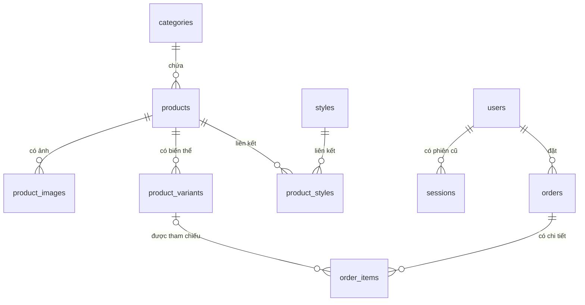

# Các mối quan hệ trong database shop-app

<!-- Đối chiếu với catalog-schema.sql, auth-schema.sql, firebase-users-migration.sql và orders-schema.sql. -->

Tài liệu mô tả cấu trúc sau khi chạy các schema và migration Firebase theo [README](../README.md). Database có 10 bảng, chia thành danh mục sản phẩm, tài khoản và đơn hàng.

## 1. Những khái niệm cần biết

| Khái niệm | Ý nghĩa | Ví dụ trong dự án |
|---|---|---|
| Khóa chính — PK | Xác định duy nhất một hàng trong bảng | `products.id` |
| Khóa ngoại — FK | Tham chiếu khóa của một hàng ở bảng khác | `products.category_id` tham chiếu `categories.id` |
| Một–nhiều — 1:N | Một hàng cha có thể có nhiều hàng con | Một sản phẩm có nhiều ảnh |
| Nhiều–nhiều — N:N | Mỗi bên có thể liên kết nhiều hàng của bên còn lại | Sản phẩm và phong cách |
| Bảng nối | Lưu từng cặp liên kết để biểu diễn N:N | `product_styles` |
| Snapshot | Bản sao thông tin tại một thời điểm | Tên và giá sản phẩm trong `order_items` |

Khóa ngoại giúp database từ chối dữ liệu liên kết không tồn tại. Ví dụ, không thể tạo sản phẩm có `category_id = 'cat-missing'` nếu danh mục đó chưa tồn tại.

## 2. Sơ đồ quan hệ



`||` là đúng một, `o{` là từ không đến nhiều, `|o` là không hoặc một. Sơ đồ phản ánh ràng buộc SQL: một sản phẩm có thể chưa có ảnh/biến thể và một đơn có thể chưa có chi tiết. Backend bổ sung kiểm tra khi xuất bản sản phẩm và tạo đơn.

`order_items.product_id` **không có khóa ngoại đến `products`**, nên không có đường FK tương ứng trong sơ đồ. Firebase nằm ngoài PostgreSQL, cũng không được thể hiện như một bảng SQL.

## 3. Các khóa ngoại và hành vi khi xóa

| Bảng con / cột FK | Tham chiếu | Quan hệ | Khi xóa hàng cha |
|---|---|---|---|
| `products.category_id` | `categories.id` | Danh mục 1:N sản phẩm | `RESTRICT`: chặn nếu danh mục còn sản phẩm |
| `product_images.product_id` | `products.id` | Sản phẩm 1:N ảnh | `CASCADE`: xóa ảnh đi kèm |
| `product_variants.product_id` | `products.id` | Sản phẩm 1:N biến thể | `CASCADE`: xóa biến thể đi kèm |
| `product_styles.product_id` | `products.id` | Sản phẩm 1:N dòng nối | `CASCADE`: xóa dòng nối đi kèm |
| `product_styles.style_id` | `styles.id` | Phong cách 1:N dòng nối | `CASCADE`: xóa dòng nối đi kèm |
| `sessions.user_id` | `users.id` | Người dùng 1:N phiên cũ | `CASCADE`: xóa các phiên cũ |
| `orders.user_id` | `users.id` | Người dùng 1:N đơn | `RESTRICT`: chặn nếu người dùng đã có đơn |
| `order_items.order_id` | `orders.id` | Đơn 1:N chi tiết | `CASCADE`: xóa chi tiết của đơn |
| `order_items.variant_id` | `product_variants.id` | Biến thể 1:N chi tiết | `SET NULL`: bỏ tham chiếu, giữ chi tiết đơn |

Đây là hành vi **của database khi xóa bằng SQL**. Giao diện/API có thể áp dụng quy tắc chặt hơn: sản phẩm đã có đơn không được xóa; biến thể đã có đơn được ngừng sử dụng thay vì xóa hoặc đổi màu/kích cỡ. Tài khoản dùng khóa/mở thay vì xóa.

## 4. Danh mục và sản phẩm

`categories.id` → `products.category_id`.

Một danh mục có thể chứa nhiều sản phẩm. Mỗi sản phẩm bắt buộc thuộc đúng một danh mục vì `category_id` là `NOT NULL`.

Ví dụ:

| `products.id` | Tên | `category_id` |
|---|---|---|
| `p1` | Áo thun cotton cơ bản | `cat-tshirt` |
| `p7` | Áo thun in hình | `cat-tshirt` |

Hai sản phẩm dùng cùng ID danh mục; tên danh mục được lưu một lần trong `categories`. Khi sửa tên “Áo thun”, không cần sửa từng sản phẩm.

## 5. Sản phẩm, ảnh và biến thể

### Ảnh

`products.id` → `product_images.product_id`.

Mỗi dòng `product_images` là một ảnh, với URL và thứ tự `position`. `UNIQUE(product_id, position)` ngăn hai ảnh của cùng sản phẩm chiếm một vị trí. Hai sản phẩm khác nhau vẫn có thể có ảnh ở vị trí 0.

### Biến thể

`products.id` → `product_variants.product_id`.

Một biến thể là một kết hợp màu và kích cỡ, có tồn kho riêng:

| Sản phẩm | Màu | Kích cỡ | Tồn kho minh họa |
|---|---|---|---|
| `p1` | `Black` | `S` | 8 |
| `p1` | `Black` | `M` | 18 |
| `p1` | `White` | `S` | 10 |

`UNIQUE(product_id, color, size)` ngăn tạo hai biến thể giống nhau trong cùng sản phẩm. Cùng màu/kích cỡ ở sản phẩm khác vẫn hợp lệ.

Khi thêm giỏ hàng, ứng dụng lưu `variantId` và số lượng. Nhờ đó backend biết cần trừ tồn kho của đúng biến thể, thay vì trừ một số lượng chung cho sản phẩm.

## 6. Sản phẩm và phong cách: nhiều–nhiều

Quan hệ được biểu diễn qua `product_styles`:

```text
products.id ← product_styles.product_id
styles.id   ← product_styles.style_id
```

Một sản phẩm có thể thuộc nhiều phong cách; một phong cách có thể áp dụng cho nhiều sản phẩm.

Ví dụ:

| `product_id` | `style_id` |
|---|---|
| `p1` | `style-casual` |
| `p1` | `style-gym` |
| `p7` | `style-casual` |

`p1` thuộc Thường ngày và Thể thao; Thường ngày có cả `p1` và `p7`. Khóa chính ghép `(product_id, style_id)` ngăn lặp lại cùng một liên kết. Bảng nối không cần thêm cột `id` riêng.

## 7. Tài khoản, Firebase và phiên đăng nhập

### Firebase và `users`

`users.id` là ID hồ sơ trong PostgreSQL. `users.firebase_uid` là UID của tài khoản Firebase đã được server xác thực. Hai ID này có vai trò khác nhau; đơn hàng tham chiếu `users.id`.

`firebase_uid` có `UNIQUE`, nên mỗi UID không rỗng chỉ liên kết tối đa một hồ sơ shop. Cột này được phép `NULL` cho hồ sơ cũ chưa liên kết; SQL không tạo FK đến Firebase vì Firebase là dịch vụ bên ngoài.

Sau migration, `username` và `password_hash` cũng được phép `NULL`. Ràng buộc `users_auth_identity_check` yêu cầu có Firebase UID hoặc mật khẩu băm của thiết kế cũ. Hồ sơ Firebase mới không lưu mật khẩu Firebase tại PostgreSQL.

`users.role` lưu `customer` hoặc `admin`; `is_active` thể hiện tài khoản còn được sử dụng trên website. Không cần tạo bảng admin riêng. Email có ràng buộc duy nhất; backend không tự ghép tài khoản cũ chỉ vì trùng email.

### `users` và `sessions`

`users.id` → `sessions.user_id` là quan hệ 1:N, cho phép một người dùng có nhiều phiên trong thiết kế cũ. `sessions.token_hash` là khóa chính.

**Luồng Firebase hiện không ghi phiên vào bảng `sessions`.** Backend tạo cookie session Firebase và dùng Firebase Admin để xác thực, sau đó đọc `users` để kiểm tra hồ sơ, trạng thái và quyền.

## 8. Người dùng và đơn hàng

`users.id` → `orders.user_id`.

Một người dùng có thể đặt nhiều đơn. Mỗi đơn bắt buộc có một chủ đơn đang tồn tại. Các API của khách dùng quan hệ này để chỉ trả hoặc hủy đơn thuộc chính tài khoản đăng nhập.

`UNIQUE(user_id, request_id)` ngăn tạo trùng đơn cho cùng khóa yêu cầu của một người dùng. `request_hash` giúp backend phát hiện yêu cầu đã đổi nội dung nhưng vẫn dùng khóa cũ.

Thông tin giao hàng được lưu tại `orders.shipping_name`, `shipping_phone`, `shipping_address`, `shipping_note`. Đây là snapshot cho từng đơn; thay đổi tên hồ sơ không làm thay đổi người nhận của đơn cũ. Người nhận cũng có thể khác người đặt.

## 9. Đơn hàng, chi tiết và sản phẩm gốc

`orders.id` → `order_items.order_id` là 1:N. Mỗi dòng chi tiết lưu sản phẩm/biến thể đã mua, số lượng và đơn giá tại lúc đặt.

`order_items.variant_id` tham chiếu biến thể hiện tại nhưng được phép `NULL`. Nếu biến thể bị xóa bằng SQL, FK sẽ thành `NULL`; các cột snapshot vẫn còn.

Các cột snapshot gồm:

- `product_id`: mã sản phẩm lúc mua, không có FK đến `products`.
- `product_name`, `color`, `size`: thông tin lúc mua.
- `unit_price`, `quantity`: đơn giá và số lượng để tính tiền lịch sử.

Ví dụ: khách mua áo giá 189.000₫; hôm sau admin đổi giá sản phẩm thành 199.000₫. Chi tiết đơn vẫn lưu 189.000₫, vì không lấy lại giá hiện tại khi hiển thị lịch sử.

Việc tổng `orders.total` bằng tổng `unit_price × quantity` của các dòng chi tiết được backend bảo đảm khi tạo đơn, không phải ràng buộc FK/CHECK giữa hai bảng.

## 10. Ví dụ luồng đặt hàng

1. Khách đăng nhập Firebase; server xác thực và tìm hồ sơ `users` qua UID.
2. Khách chọn màu/kích cỡ; giỏ hàng ghi ID của `product_variants` và số lượng.
3. API đọc sản phẩm và biến thể từ database, kiểm tra trạng thái, giá và tồn kho.
4. Trong transaction, backend tạo `orders` với `user_id` của người đặt và snapshot giao hàng.
5. Backend tạo các dòng `order_items`, trừ tồn kho biến thể và cập nhật số lượt bán.
6. Transaction thành công thì ghi nhận tất cả; nếu lỗi thì rollback toàn bộ.
7. Admin đổi trạng thái theo `preparing → shipping → delivered`. Hủy đơn khi còn `preparing` chuyển sang `cancelled` và hoàn tồn kho cho các biến thể còn tồn tại.

## 11. Những phần chưa có bảng riêng

- Giỏ hàng hiện nằm trong `localStorage`, chưa có `carts`/`cart_items`.
- Chưa có bảng thanh toán vì luồng hiện bỏ qua thanh toán trực tuyến.
- Chưa có bảng địa chỉ dùng lại; thông tin người nhận được lưu theo từng đơn.
- Màu, kích cỡ và trạng thái là các giá trị được giới hạn trong schema, không phải các bảng riêng.

## 12. Xem khóa ngoại trong pgAdmin

Chọn database `shop_app` → Query Tool và chạy câu truy vấn chỉ đọc sau:

```sql
-- Liệt kê khóa ngoại thật và quy tắc tham chiếu của schema public.
SELECT
    con.conrelid::regclass AS bang_con,
    con.conname AS ten_khoa_ngoai,
    con.confrelid::regclass AS bang_cha,
    pg_get_constraintdef(con.oid) AS dinh_nghia
FROM pg_constraint con
JOIN pg_namespace ns ON ns.oid = con.connamespace
WHERE con.contype = 'f' AND ns.nspname = 'public'
ORDER BY con.conrelid::regclass::text, con.conname;
```

Các file tham chiếu: [catalog-schema.sql](catalog-schema.sql), [auth-schema.sql](auth-schema.sql), [firebase-users-migration.sql](firebase-users-migration.sql), [orders-schema.sql](orders-schema.sql).
